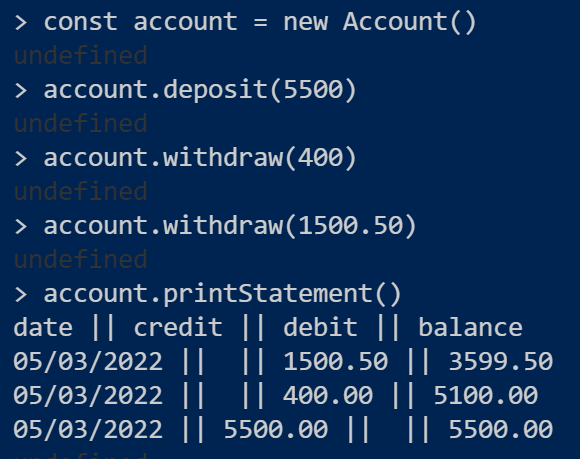

# Bank tech test

## Requirements

* You should be able to interact with your code via a REPL like IRB or Node.  (You don't need to implement a command line interface that takes input from STDIN.)
* Deposits, withdrawal.
* Account statement (date, amount, balance) printing.
* Data can be kept in memory (it doesn't need to be stored to a database or anything).

## Acceptance criteria

**Given** a client makes a deposit of 1000 on 10-01-2023  
**And** a deposit of 2000 on 13-01-2023  
**And** a withdrawal of 500 on 14-01-2023  
**When** she prints her bank statement  
**Then** she would see

```
date || credit || debit || balance
14/01/2023 || || 500.00 || 2500.00
13/01/2023 || 2000.00 || || 3000.00
10/01/2023 || 1000.00 || || 1000.00
```

## Undertaking

Built a node.js bank account app which runs in the terminal and implements the following features as per requirements:

* making a deposit
* making a withdrawal
* printing a bank statement



## Technologies

* Node - backend
* Mocha, Chai, Nyc, Sinon - unit testing (including testing output to console)

## Structure

Code is strucutred within an account class and a printer class to uphold Single Responsibility Principles (SRP).

## How to run the app

* Clone this repo

```
git clone https://github.com/j-cort/bank_tech_test.git
```

* Move into the app's directory and run npm i to download dependencies

```
cd bank_tech_test/
npm i
```

* Run tests

```
npm test
```

* Run Account.js from the terminal with the following:

```
node 
const Account = require("./model/Account") 
const account = new Account()
```

* Try interacting with the bank account:

```
account.deposit(5500)
account.withdraw(400)
account.withdraw(1500.50)
account.printStatement()
```
